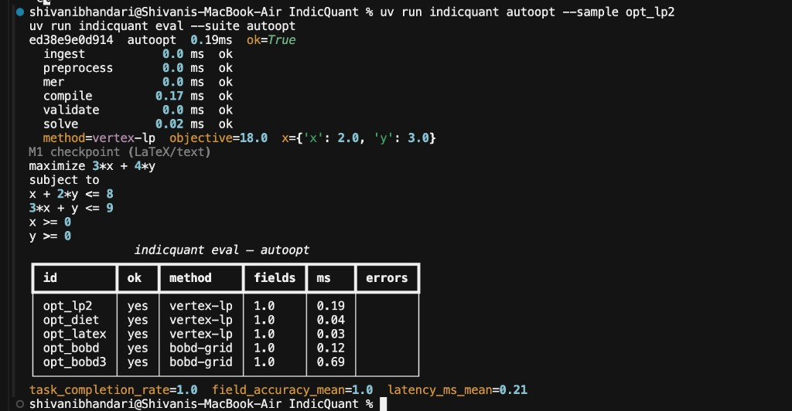
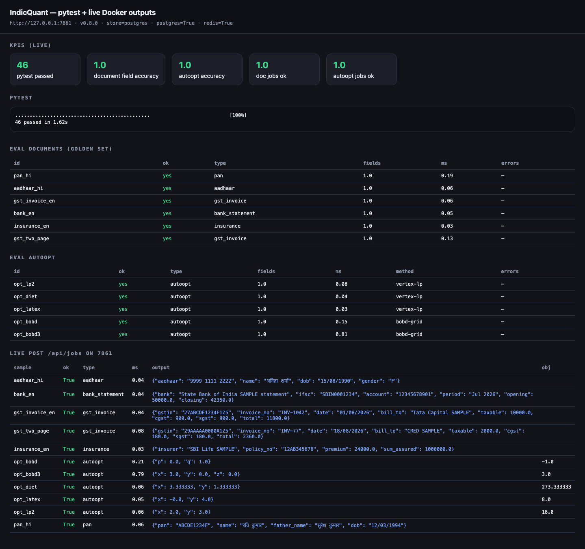
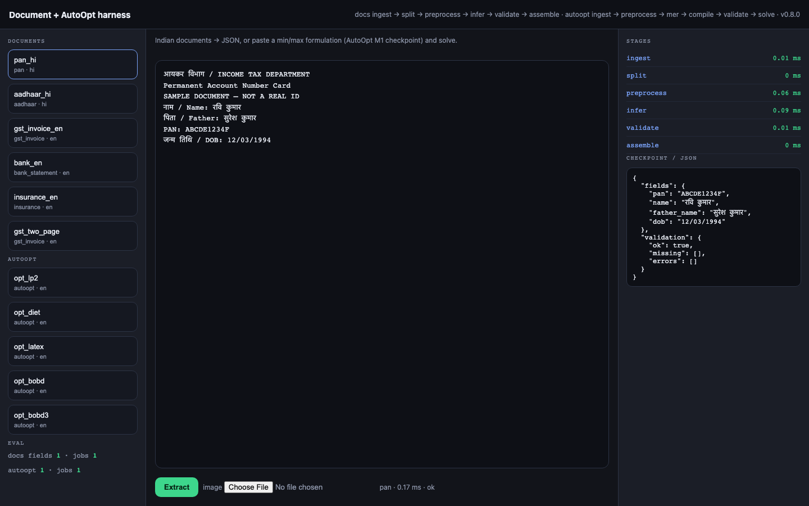
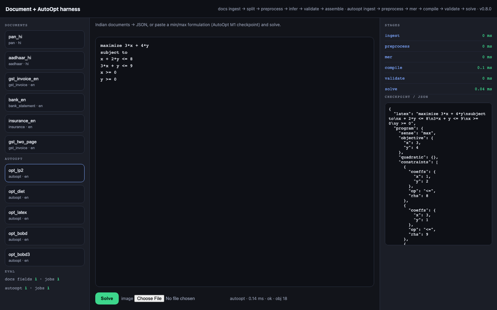
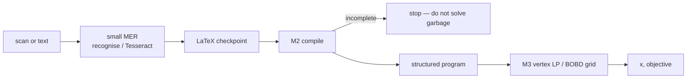

# IndicQuant

Document intelligence for Indian paperwork, plus AutoOpt (arXiv:2510.21436) as a **checked three-module loop**: mer → compile → solve. Field names stay English; values may be Hindi, Tamil, or native digits. Extractors and the LP compiler are code. This machine does not train or serve a 30B VLM, AutoOpt-M1 (393M), or DeepSeek-Coder 1.3B.

Identity numbers in `evals/` are **SAMPLE / fake**.

## Results (measured here)

CLI, 19 Aug 2026 — `uv run indicquant autoopt --sample opt_lp2` then `uv run indicquant eval --suite autoopt`:



| | |
|---|---|
| `opt_lp2` | vertex-lp, \(x=2, y=3\), objective **18.0**, 0.19 ms |
| autoopt suite (then) | 5/5, field accuracy **1.0**, mean 0.21 ms |
| pytest (now, v0.9.0) | **49 passed** |
| documents golden set | **12/12**, field accuracy **1.0** |
| autoopt golden set | **10/10**, including incomplete + infeasible checkpoints |

Live Compose (`http://127.0.0.1:7861`) was postgres + redis, version 0.8.0 at capture time; this tree is **0.9.0**.

## Snapshots

UI and job JSON live under [`results/demo/`](results/demo/).

| File | What |
|---|---|
| [00_testing_report.png](results/demo/00_testing_report.png) | pytest + both evals + live `/api/jobs` |
| [01_console.png](results/demo/01_console.png) | console, both golden lists |
| [02_pan_extract.png](results/demo/02_pan_extract.png) | PAN hi → JSON, 0.17 ms |
| [06_aadhaar.png](results/demo/06_aadhaar.png) | Aadhaar hi |
| [05_gst_extract.png](results/demo/05_gst_extract.png) | GST invoice |
| [03_autoopt_lp2.png](results/demo/03_autoopt_lp2.png) | mer checkpoint + obj 18 |
| [09_opt_diet.png](results/demo/09_opt_diet.png) | diet LP, obj 273.33 |
| [04_autoopt_bobd.png](results/demo/04_autoopt_bobd.png) | quadratic BOBD, obj −1 |
| [12_cli_autoopt_eval.png](results/demo/12_cli_autoopt_eval.png) | terminal eval (above) |
| `jobs/*.json`, `cli/*.txt` | raw API and CLI output |







## Data

Not a training corpus. Golden sets are the test distribution; adding rows is how we raise coverage without a GPU.

| Set | Path | n | Notes |
|---|---|---|---|
| Documents | `evals/documents.json` | 12 | hi, ta, native digits, IGST, two-page GST, DL |
| AutoOpt | `evals/autoopt.json` | 10 | LP, LaTeX, BOBD, equality, joint bounds, compile fail, infeasible |
| Scans | `evals/scans.json` + `evals/scans/*.png` | 4 | labelled pages + noisy OCR for the small MER |
| Booking (legacy) | `evals/indic_booking.json` | scripted agent | not the hiring path |

New document rows: `pan_ta`, `pan_hi_digits`, `aadhaar_ta`, `gst_igst_en`, `bank_hi`, `dl_en`.  
New AutoOpt rows: `opt_eq`, `opt_joint`, `opt_max1d`, `opt_incomplete`, `opt_infeasible`.

A scanned AutoOpt-11k / real PAN dump would be the next data step. It needs labelled pages and a machine that can run MER, not this 16 GB CPU laptop.

## Labelled scans → small MER

That is the Sarvam-shaped next layer. Same loop: **mer → compile → solve**. The recogniser is small and checked; it is not 30B weights on a 16 GB Air.

| Piece | What shipped | What it is not |
|---|---|---|
| Pages | `evals/scans/*.png` + gold LaTeX in `evals/scans.json` | AutoOpt-11k |
| Small MER | `indicquant.autoopt.mer.recognise` — sense lexicon + `≤`/`s.t.` repair | ResNet+Swin+Nougat 393M |
| Eval | `uv run indicquant eval --suite scans` | BLEU vs the paper |

Tesseract can sit in front of `recognise` when an image is uploaded. pytest uses stored OCR noise so CI stays offline.

```bash
uv run indicquant eval --suite scans
```

## Pipelines

```
document  ingest → split → preprocess → infer → validate → assemble
autoopt   ingest → preprocess → mer → compile → validate → solve
```



Validate on GST checks `taxable + cgst + sgst + igst ≈ total`. Compile fails closed-loop if min/max or constraints are missing (AutoOpt’s reason for a LaTeX checkpoint). M3 is vertex LP in two variables, or a grid on one complicating variable (BOBD without a GA).

## Run

```bash
uv venv --python 3.11 && uv pip install -e '.[dev]'
uv run indicquant extract --sample pan_hi
uv run indicquant autoopt --sample opt_lp2
uv run indicquant eval
uv run indicquant eval --suite autoopt
uv run indicquant eval --suite scans
uv run pytest -q
```

UI: `uv run indicquant serve` → http://127.0.0.1:7860  
Compose: `docker compose up --build` → http://127.0.0.1:7861 (do not leave an old `serve` on 7860).

```bash
curl -s http://127.0.0.1:7861/api/jobs -H 'content-type: application/json' -d '{"sample_id":"opt_lp2"}'
```

## What still improves this for Sarvam

Yes. The loop is the product; the recogniser is the next layer.

1. **Real pages** — swap the rendered `evals/scans/*.png` for labelled camera pages. Same `scans.json` schema, same MER.
2. **A slightly larger MER** — CTC/ONNX on those pages, still emitting LaTeX into M2. Keep compile as the checkpoint.
3. **More scripts** — Telugu, Kannada, Bengali labels in `extract.py` + golden rows. `ascii_digits` already covers Devanagari/Tamil/Odia digits.
4. **A real LP backend** — optional HiGHS/CBC; vertex/BOBD stays the no-dep path.
5. **Serving** — Compose is Postgres + Redis + API, not K8s/Temporal/GPU.

What we will not do on this laptop: train 393M Nougat, fine-tune 1.3B DeepSeek-Coder, or run Sarvam-30B.

## Layout

```
evals/documents.json          document golden set
evals/autoopt.json            AutoOpt golden set
src/indicquant/harness/       ingest → assemble, schemas, jobs
src/indicquant/autoopt/       m1 preprocess, m2 compile, m3 solve
src/indicquant/eval/          docs + autoopt scoring
results/demo/                 screenshots and live JSON
```
